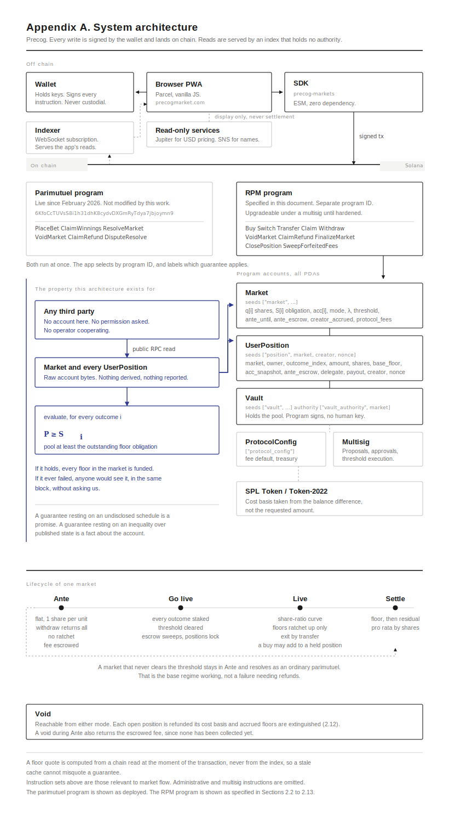

# Precog RPM Upgrade

### The Ratcheting Parimutuel Market

*An open mechanism in the parimutuel market maker class, with self-financing payout floors and solvency anyone can check*

**Nathan Green**
Publisher, Precog Markets

Revision 1, July 2026

---

## Abstract

A market that prices continuously cannot quote an empty book, and seeding one requires capital from an operator or a designated liquidity provider, which decides in advance which markets are allowed to exist. This document specifies RPM, the ratcheting parimutuel market, a mechanism in the parimutuel market maker (PMM) class set out by Melee Markets in July 2026. An RPM market opens flat with no capital committed by anyone, stays liquid at par until every outcome carries stake and a published threshold is cleared, and then converts to share-ratio curve pricing initialized from the stakes already present, so the payout ratio is continuous across the handoff. Every position carries a floor quoted at purchase and equal to what was paid, which rises as capital arrives on opposing outcomes at a rate fixed at market creation and published. A position in the realized outcome is paid at least its floor.

The construction rests on a single inequality: the pool is at least the outstanding floor obligation on every outcome, after every operation. We show it is preserved by every operation the mechanism supports, give a constant-time accumulator that maintains it while positions enter at arbitrary times, and specify the integer arithmetic the deployed form requires along with the rounding discipline that keeps the aggregate obligation from falling short of what holders can claim. The condition is evaluable by any third party from public account state, with no operator participating.

Solvency conditions of this form are established in the parimutuel call auction literature and are routine in decentralised finance, and guaranteed principal in an on-chain prediction market was deployed on Solana in 2021. Section 2.1 sets out what we found and what is and is not claimed as a result.

---

**Implementation.** The reference simulator and the protocol it extends are MIT licensed and public. Precog has operated as a parimutuel prediction market on Solana since February 2026.

**Reproducibility.** Every numeric claim in this document is regenerated by a script in the accompanying repository.

---

# Section 1: Introduction

## 1.1 The problem a curve cannot solve on its own

A market that prices continuously needs shares outstanding before it can quote. An automated market maker over `n` outcomes has no opinion about an empty book: with nothing bought on any outcome, every price is `0/0`. The standard answer is to seed the market, either from the operator's balance sheet or from a designated liquidity provider who is compensated for the risk. Both answers reintroduce the thing a permissionless venue exists to remove. Someone has to fund a market before anyone can trade it, and whoever that is decides which markets exist.

The parimutuel has the opposite properties. It needs no seed, it holds no position, and it cannot be insolvent, because it never pays out more than it took in. What it does not have is a price that moves while the market is open, or any reason to arrive early rather than late. Every participant in a parimutuel is quoted the same terms as everyone who follows them, which is fair in a way that is also inert.

## 1.2 The class

In July 2026 Melee Markets set out the parimutuel market maker, or PMM, naming a class of mechanism that opens as an ordinary parimutuel, converts to continuous pricing once a liquidity condition is met, and records a minimum return for each position at the moment it enters. Their paper states five requirements a permissionless prediction market has to satisfy and describes a construction meeting them. The curve family, the parameter schedule and the rebalancing implementation are stated to be proprietary.

We think the class is the right one, and this document is written inside it rather than against it. Four elements of what follows come from that paper and are attributed where they appear: the five requirements, the idea of a minimum-return floor recorded at entry, the use of counterparty liquidity to mean stake held against an outcome rather than two-sided depth, and the pattern of converting a parimutuel to continuous pricing at a threshold.

## 1.3 What this document specifies

RPM, the ratcheting parimutuel market, is a mechanism in that class. A market opens flat, with one share per unit on every outcome and no capital committed by anyone. Positions are liquid at par until the market goes live. Once every outcome carries stake and the pool clears a published threshold, the market converts to a share-ratio curve initialized from the stakes already present, so the payout ratio is continuous across the handoff. A market that never converts resolves as an ordinary parimutuel, which is the base regime working normally rather than a failure needing refunds.

Every position carries a floor, quoted when it is bought and equal to what was paid. The floor rises, and only rises, as capital arrives on the outcomes opposing it, at a rate `λ` fixed at creation and published per market. If the position's outcome resolves true it is paid at least its floor. One inequality carries the whole construction: the pool is at least the outstanding floor obligation on every outcome, after every operation.

The reason to state it that way is that anyone can check it. The condition is evaluable by a third party reading public account state, with no operator cooperating and no trust in our arithmetic. A guarantee that rests on an undisclosed schedule is a promise. A guarantee that rests on an inequality over published state is a fact about the account.

## 1.4 What is claimed, and what is not

Solvency conditions of this shape are old and widespread. They are established in the parimutuel call auction literature of the mid 2000s and they are routine in decentralised finance, where lending protocols, collateralised debt positions and perpetual venues all enforce a condition of the same form. Guaranteed principal in an on-chain prediction market is not new either, having been deployed on Solana in 2021. None of that is claimed here, and section 2.1 sets out what we found when we looked.

What is offered is a combination and the proofs that hold it together: the condition maintained continuously across curve pricing rather than at a single clearing, an obligation assembled from individually quoted entry-time floors rather than a fixed schedule, a constant-time accumulator that maintains it while positions enter at arbitrary times, and the whole of it verifiable from outside. Where we say novel we mean novel to our knowledge, and we say what we searched.

## 1.5 Reproducibility and status

The mechanism is implemented in a reference simulator that asserts the invariant, the accumulator bounds, floor monotonicity and the absence of overpayment after every mutation, across randomized adversarial market histories. Every numeric claim in this document is regenerated by a script in the same repository. The implementation is MIT licensed, as is the protocol it extends, which has been running as an open source parimutuel prediction market on Solana since February 2026.

This specification is maintained alongside that implementation and is revised as the work proceeds. The revision that produced any given figure is recorded in the repository.

## 1.6 Structure

Section 2 specifies the mechanism: the market object, the invariant, the two pricing regimes and the conversion between them, the floor and its financing, switching, transfer, settlement, and the integer arithmetic the deployed form requires. It states the lemmas and theorems that establish preservation of the invariant under every operation, and closes with the limits of what is promised.

---

# Section 2: How an RPM Market Works

---

## 2.1 Prior work, and what is claimed here

This section describes a construction, not a category. The category is the parimutuel market maker, which Melee Markets named and set out in their PMM litepaper of July 2026. We are working inside their framing and it is worth saying so at the start rather than leaving it to be discovered.

Four things here come from that paper. The five requirements a permissionless prediction market has to satisfy. The idea of a minimum-return floor recorded at entry. The use of "counterparty liquidity" to mean the stake held against an outcome rather than two-sided depth. And the pattern of opening a market as an ordinary parimutuel and converting it to continuous pricing once a liquidity threshold is met, which is where our Ante mode comes from.

The pricing curve is older. Pennock's dynamic parimutuel market (2004) gives the share-ratio cost function used here, along with the property that every outcome reprices when any outcome is bought.

Older still is the idea at the centre of this section. Lange and Economides (2005) set out a parimutuel microstructure for contingent claims in which the organizer guarantees a fixed payout on an accepted order, funded entirely from the premium collected across all orders. Peters, So and Ye (2006) recast that as a convex programme, the convex parimutuel call auction mechanism, where the guarantee appears as a per-state feasibility constraint. That constraint is the same shape as the invariant in 2.3. It has been in the literature for twenty years and was deployed commercially on bank-run auctions for economic statistics.

The important difference is that all of this prior work describes a call auction. Trading is non-continuous by construction, the book clears once, and a central organizer solves an optimization at close to decide which orders to accept.

Two further bodies of prior art sit closer to this work than the academic literature does. Solvency conditions of the form used in 2.3, meaning pooled assets checked against the obligations owed under any single branch after every state change, are standard practice in decentralised finance. Lending protocols, collateralised debt positions, perpetual futures venues and options protocols all enforce a condition of this shape, and the conditional token frameworks underlying several operating prediction markets enforce full collateralisation structurally, since a complete set of outcome tokens costs one unit of collateral. The form of the invariant is not what is claimed here.

Guaranteed principal in an on-chain parimutuel prediction market is not new either. Hedgehog Markets launched on Solana in September 2021 with no-loss competitions in which participants recovered their full stake regardless of result, funded by depositing that stake into a lending protocol and using the yield as the prize pool. The guarantee there is unconditional where ours is conditional on the outcome winning, and it caps upside at the yield where ours does not, but the category was occupied five years before this work.

### Contributions

This work makes the following contributions.

1. We state a solvency condition, `P ≥ Sᵢ`, for a continuously traded parimutuel market carrying entry-time payout floors, and show that it is preserved by every operation the mechanism supports (Lemmas 1 to 3, Theorems 1 and 2). Constraints of this form are established in the call auction literature and are routine in decentralised finance. The contribution is that the condition is maintained after each individual trade rather than at a single clearing, that the obligation it bounds is an accumulated set of individually quoted entry-time floors rather than a fixed schedule, and that it is evaluable by a third party from public account state with no operator participating.

2. We show that a payout floor set equal to a position's own cost basis is self-financing, in the sense that the deposit creating the position is by itself sufficient to fund its guarantee, at any pool state and for any participant (Lemma 1). Guaranteed payouts in the prior literature are determined by auction clearing rather than by what the participant paid, and principal guarantees in operating on-chain venues have been funded externally, typically from lending yield on the deposit, rather than by the deposit itself.

3. We give a constant-time accumulator construction that maintains per-outcome floor obligations while positions enter at arbitrary times, avoiding iteration over positions at any point in the market's life.

4. We give a financing rule under which floors ratchet upward from counterparty capital at a rate `λ` fixed at market creation and published, and show that it preserves the invariant for all `λ` strictly below 1 (Lemma 2).

5. We give a closed form for switching between outcomes under the share-ratio cost function which preserves the pool exactly and requires a single square root (2.8).

6. We derive a bound on pre-resolution withdrawal and characterise the capacity it permits. That capacity is a function of the obligation standing on every outcome, so it moves with trades the withdrawing position does not control, and it cannot be quoted to a position in advance or guaranteed to it at any point. We adopt position transfer as the exit mechanism in consequence (2.9).

7. We specify a rounding discipline under which the invariant survives integer truncation, and exhibit a natural but incorrect alternative which fails (2.11).

8. We describe an opening phase in which capital may be withdrawn at par, and identify the condition on reward accrual under which this is compatible with the invariant (2.4).

### Status of each contribution

Provenance and verification are separate questions and are recorded separately below. Verified means the reference simulator asserts the property after every mutation across the suites listed in the verification table. Novel to our knowledge means we searched and did not find it, which is a weaker statement than novel.

| # | Provenance | Verification |
|---|---|---|
| 1 | Constraint form standard in the call auction literature and in DeFi practice. Continuous maintenance across curve pricing, and third-party evaluability, novel to our knowledge | Verified |
| 2 | Novel to our knowledge. Distinct from externally funded principal guarantees in operating venues | Verified, Lemma 1 |
| 3 | Novel to our knowledge | Verified |
| 4 | Floor concept from Melee (2026); this financing rule novel to our knowledge | Verified, Lemma 2 |
| 5 | Follows directly from the cost function; presented for completeness | Verified |
| 6 | Bound follows from (I); the characterisation is ours | Bound and capacity behaviour measured |
| 7 | Standard practice in fixed-point arithmetic; the specific failure mode may be of interest | Verified, including the counterexample |
| 8 | Novel to our knowledge | Verified, conditional on rewards not accruing during Ante |

Melee's production curve family, parameter schedule and rebalancing implementation are proprietary and undisclosed, so we cannot compare constructions directly and do not attempt to. We can only publish ours.

The parimutuel implementation this work extends has been running on Solana since 19 February 2026, when its program was deployed to mainnet at `6KfoCcTUVsS8i1h31dhK8cydvDXGmRyTdya7jbjoymn9`. The client library and application were open source from that week; the program source was published later. All of it is MIT licensed now, and the deployment is the earliest record of this work that a reader can check without taking our word for anything.

### Scope of the novelty search

Claims of novelty are only as good as the search behind them.

In the academic literature we reviewed the dynamic parimutuel work descending from Pennock (2004); the contingent claims parimutuel work descending from Lange and Economides (2003, 2005), including the convex reformulations of Peters, So and Ye (2006) and Agrawal et al. (2011); and Hanson's market scoring rules.

On chain we reviewed the collateralisation and health-factor conditions used by lending protocols, collateralised debt positions, perpetual futures venues and options protocols; the conditional token frameworks underlying operating prediction markets; and the principal-protected prediction market designs deployed on Solana, in particular Hedgehog Markets from 2021.

We did not conduct a patent search beyond noting that US 7,801,804 covers the convex parimutuel call auction mechanism as a centrally organized call auction.

Where a claim above has prior art we have missed, we would welcome the correction and will cite it in revision.

---

## 2.2 The market object

An RPM market is an event, a resolution rule, and `n` mutually exclusive outcomes with `2 ≤ n ≤ 10`. A Yes / No / Maybe market is the `n = 3` case and needs nothing special.

Participants hold positions. A position records the outcome it backs, the shares it holds, its cost basis net of fees, a base floor, an accumulator snapshot, and an owner.

The market tracks three values per outcome: shares outstanding `qᵢ`, outstanding floor obligation `Sᵢ`, and a reward accumulator `accᵢ`. It tracks one value globally: the pool `P`, meaning everything deposited net of fees.

A position's floor is derived rather than stored:

```
Fₚ = b + s · (accᵢ − a)
```

This is the standard staking accumulator. It credits rewards to every holder of an outcome in constant time without touching individual positions, which matters because a market can hold thousands of positions and a Solana instruction cannot iterate over them.

---

## 2.3 The invariant

One inequality holds for every outcome `i` at every point in a market's life.

```
(I)     P ≥ Sᵢ
```

The pool is never smaller than the floor obligation standing on any single outcome.

**Theorem 1.** If (I) holds when a market resolves, every position in the realized outcome can be paid at least its floor.

Let `w` be the realized outcome. Total owed to floor holders on `w` is `S_w`, which by (I) is at most `P`. The residual `P − S_w` is non-negative, so each position can be paid its floor with value left over.

The proof is short because the invariant carries the weight. The rest of this section shows that every operation preserves (I), and each of those proofs is a few lines as well. None of them depends on a parameter being tuned correctly, an oracle behaving, or an operator being honest.

A guarantee resting on an undisclosed pricing schedule is a promise. (I) can be evaluated by anyone reading the market account, without our cooperation and without trusting our arithmetic. What that state is worth depends on the code deployed at the program's address, which is public and, at launch, upgradeable. 2.13 states where that stands and where it is going.

---

## 2.4 Ante

A market opens in Ante. One unit of value buys one share, on every outcome, for everyone. There is no curve, no seed capital, no cost to the creator beyond account rent, and no advantage to arriving first.

Ante exists because a curve cannot price an empty market. With no shares outstanding every price is `0/0`. Rather than manufacture liquidity to escape that, the market starts in the regime that does not need any.

Two things separate Ante from an ordinary bootstrap phase.

Capital is not locked. A position can be withdrawn at par at any time before the market goes live, returning its full cost basis. Nobody has to commit to a board before seeing how it fills in.

No rewards accrue. Ratchets are switched off until go-live. This is the condition that makes free withdrawal safe, and it is the correct rule on its own terms as well. A participant who can leave at will is not bearing risk and should not be earning for it. Exposure starts when the capital commits.

The result is a phase where a participant's money is unconditionally theirs. That is a stronger statement than the Live guarantee, which returns a stake only if the outcome wins. In Ante there is no outcome risk at all.

A market stays in Ante until every outcome carries some stake and the pool clears a threshold set at creation. A market that never satisfies both resolves as an ordinary parimutuel. That is the base regime operating normally, not a failure requiring refunds.

Ante collects no fee. The entry fee is charged once at go-live against the positions that convert, which keeps withdrawal genuinely costless and still collects from everyone who actually participates. It preserves (I) across 2,000 markets at fee rates to 5%, conditional on rewards not accruing during Ante. The two together break the invariant in 278 of 2,000 markets, and neither does so alone.

Collecting at go-live cannot be done by walking the positions. They are separate accounts, a market has no bound on how many, and no single instruction can touch them all. The fee is therefore computed on each buy as it happens and escrowed against the position that generated it, held outside the pool and outside `P`. A withdrawal returns the cost basis together with that escrow, so leaving during Ante returns the entire amount paid. Conversion moves the market's escrow totals into collected fees, writing to the market account and to no position, which is what keeps go-live a bounded instruction whatever the number of positions.

Escrow and a haircut applied at conversion collect the same amount, to the base unit, across 3,000 matched buy sequences. What differs is what a position holds in the meantime. The fee exists from the moment it is incurred and is attributable to the position that owes it, so a withdrawal has an exact figure to return rather than a share of an aggregate: 10,017 Ante withdrawals in that suite each returned precisely what had been paid in. The alternative of deferring the haircut to each position's first touch after conversion is arithmetically sound and drops a position's floor at that touch, which can fall at claim time, long after the number was quoted.

A market that never clears its threshold sweeps the same escrow at settlement instead, so collection does not depend on conversion and the threshold is not a dial for running a market without fees. Across 2,125 markets that never converted the sweep collected the nominal rate on every one, and across 717 that did convert it collected nothing further at settlement, the fee having already been taken at go-live. Because the escrow sits outside the pool, no sweep moves `P`, and no winning position was paid below its floor in either case.

---

## 2.5 Going live

When both conditions are met, the market initializes `qᵢ` from the stake on each outcome and switches to curve pricing.

```
C(q) = √( Σⱼ qⱼ² )          priceᵢ = qᵢ / C(q)
```

Buying `Δ` shares of outcome `i` costs `C(q + Δeᵢ) − C(q)`. Because every price is a function of the whole share vector, a purchase on one outcome reprices the entire board in the same step. That is what makes the market tradable rather than a sealed pool.

The handoff is continuous. Shares were issued at par, so `qᵢ` already equals the stake on outcome `i` and the payout ratio `P / qᵢ` is identical either side of the switch. A holder cannot detect the transition from their own position.

Going live leaves the market carrying surplus.

```
E = P − C(q) ≥ 0
```

This is value contributed during Ante that the curve does not account for. It is neither lost nor idle, and settles to winners as residual. The practical consequence is that a share pays more than its price implies, so interfaces should display the payout ratio `P / qᵢ` directly and derive the percentage from it. Deriving the ratio from a displayed price will disagree with the actual payout and read as a bug.

Once live the market is locked. Withdrawal is no longer available and exit becomes peer to peer.

---

## 2.6 Buying

A buy deposits value, pays a fee, and contributes the remainder `c` to the pool. The curve issues `s` shares costing `c`. The position's base floor is set to its own cost basis, `b = c`.

**Lemma 1.** A buy on outcome `i` preserves (I) for every outcome.

The buy sets `P′ = P + c` and `Sᵢ′ = Sᵢ + c`, so `P′ ≥ Sᵢ′` reduces to `P ≥ Sᵢ`, which held already. For any other outcome `j`, `Sⱼ` is unchanged while `P` has grown.

The consequence is the guarantee the product rests on. **If your outcome wins, you cannot lose your stake.** It holds for every buyer, on every outcome, at every pool state, at every point in a market's life. It is not rationed, not promotional, and does not require entering early. A position's floor is funded by the deposit that creates it. The floor is set against net contribution, so the amount recovered is the stake less the entry fee, which is 100 bps by default and capped at 300.

Fees are charged at entry rather than at settlement. A fee taken from a payout could push a realized payout below its floor and break Theorem 1. Taken at entry it means the floor is set against net contribution, and the guarantee is that a participant recovers what actually entered the pool on their behalf. Charging at entry also puts protocol and creator revenue on trading activity rather than on winning claims alone, so a creator earns from every buy and every switch instead of once at resolution.

### Adding to a position already held

A buyer who already holds the outcome can open a second position or add to the one they have. Both are available, and which happens is decided by the account the transaction passes rather than by the protocol. A position's address does not encode its owner or its outcome, because both are rewritten in the ordinary course of the market, by transfer and by switching respectively, and an address derived from a field cannot survive that field changing.

Adding cannot simply raise `s`. The position carries the snapshot `a`, and its floor is `b + s·(accᵢ − a)`. Raising `s` while leaving `a` where it is pays the new shares for rewards that landed before those shares existed. Moving `a` to the present without first crystallising discards every reward the position had already earned. The accrued floor has to be banked into the base before the snapshot moves.

```
b ← Fₚ + c_new        s ← s + s_new        a ← accᵢ        c ← c + c_new
```

**Corollary to Lemma 1.** A top-up preserves (I), preserves the cost-basis identity of 2.12, and cannot lower the position's floor.

The pool and `Sᵢ` move exactly as they would for a separate position, since the buy arithmetic above is untouched and only the grouping of the resulting claim differs, so Lemma 1 carries across unchanged and `P` still equals the sum of cost bases. The floor cannot fall because `b` is set to `Fₚ`, the floor the position already had, plus a non-negative addition, while `s` only grows and `accᵢ − a` is zero at the moment of the reset.

Switching into an outcome the owner already holds takes the same form, with the incoming floor being the re-quoted `min(Fₚ, H_b)` of 2.8 rather than a fresh cost basis.

The two groupings are not economically distinct. Across 2,000 matched runs the pool is identical in every one, total payout is identical in 484, and where it differs the median gap is 2 base units against a maximum of 14, never more than 1.43e-6 of the settled total, because truncation applies once per account rather than once per buy and rounds down either way. What does differ is the account count, 34,054 against 15,213 on the same trades. The choice is therefore about rent rather than about money, which is why an interface should add to an existing position by default.

---

## 2.7 Counterparty capital and the ratchet

Because every base floor equals its own cost basis, `Sᵢ` is the value staked on outcome `i`. The slack in the invariant is therefore

```
Hᵢ = P − Sᵢ = value staked on every outcome other than i
```

`Hᵢ` is not a new quantity. It is counterparty capital in the parimutuel sense, appearing as the difference the invariant leaves behind.

That gives the reward rule its shape. When a buy of `c` lands on outcome `i`, holders of every other outcome have just acquired `c` of new capital standing against them, and a fraction `λ` of it converts to permanent floor.

```
for each j ≠ i:     accⱼ += λ·c / qⱼ          Sⱼ += λ·c
```

**Lemma 2.** For `λ` strictly below 1, `Sⱼ` grows by `λc` while `P` grows by `c`, so the slack `Hⱼ` is larger after the trade than before.

The price a participant pays is the curve price, with nothing added to it. Floors are financed from capital already standing on the other outcomes.

Behaviourally, a position's floor rises as the market moves against it. Sitting in a contested market earns. Sitting in a consensus market earns very little, because little capital arrives to oppose you. Early entry is rewarded through exposure rather than through membership of a privileged class. An early position spends more of the market's life absorbing opposing flow. It does not follow that it holds more shares per unit of cost, and usually it does not: shares are bought at the price prevailing on entry, so the largest share counts go to whoever buys an outcome the crowd has pushed down, which is typically a later participant. Early entry is paid through the floor. Buying against the consensus is paid through share count. A position can carry one without the other.

We do not claim to know the right setting for `λ`. At zero the market is a dynamic parimutuel with money-back floors. As `λ` approaches 1, nearly all counterparty capital locks into guarantees, which maximizes protection and shrinks the residual that rewards being proportionally right. It trades insurance against upside. Our claim is only that it should be a published per-market parameter a participant can read before entering, rather than a schedule they take on faith.

---

## 2.8 Switching

A switch moves a position from outcome `a` to outcome `b` without value leaving the market. `P` does not change, so `C(q)` cannot change either, and the share vector slides along the surface where `qₐ² + q_b²` is constant.

```
s_b = √( q_b² + qₐ² − (qₐ − sₐ)² ) − q_b
```

One square root, no iteration. The arriving position carries the floor it held, capped by the destination's headroom.

```
F_new = min( Fₚ , H_b )
```

**Lemma 3.** `P` is unchanged. Outcome `a`'s obligation falls by `Fₚ`. Outcomes other than `a` and `b` are untouched. Outcome `b` gains `F_new ≤ H_b = P − S_b`, so `S_b + F_new ≤ P`.

Share counts round-trip exactly under the curve in real arithmetic, since the switch holds `qₐ² + q_b²` fixed and the map is its own inverse. On chain they do not: `isqrt` truncates on each leg, so a round trip strictly loses shares. Across 1,950 completed round trips in the integer model none returned more shares than it consumed, and none did across the 410 trips that complete when buys are added to positions already held. Friction therefore sits in both the share count and the floor. Each switch re-quotes the guarantee against the destination's headroom, and repeated switching can only erode it. Wash-switching is unprofitable without needing a spread to punish it.

This bounds the one promise in the system that carries a condition. A floor is monotonically non-decreasing for as long as a position stays where it is. Switching re-quotes it.

A switch into an outcome the owner already holds may either land as a separate position or be added to the existing one, on the same terms as a buy. Where it is added, the re-quoted `min(Fₚ, H_b)` takes the place of the fresh cost basis in the form given at the end of 2.6, and the corollary there applies unchanged.

---

## 2.9 Transfer and the shape of exit

Transferring a position changes its owner and nothing else. Shares, floor and accumulator snapshot pass across intact. No term in (I) is touched, so preservation is immediate.

That triviality is the whole exit design, and the alternative is worth explaining. Removing value `v` from a live pool is constrained by every outstanding obligation at once.

```
v ≤ P − max( Sₐ − Fₚ , maxⱼ≠ₐ Sⱼ )
```

The bound is not a fixed quantity, and it is worth being precise about what it does rather than assuming it forbids withdrawal. A deposit of `c` on outcome `i` raises the pool by `c` and `Sᵢ` by `c`, so it adds nothing to the capacity constrained by the outcome it lands on. It raises every other obligation by `λc` against a pool that grew by `c`, so it adds `(1 − λ)c` to the capacity constrained by those. Since the bound is a maximum taken over every outcome, it holds flat only while flow keeps arriving on whichever outcome currently binds, and it rises otherwise.

Measured across 13,381 buys spanning 600 markets, 8,805 raised the bound and 4,576 left it flat or lower, and one position finished with 137.6 times the capacity it started with. Sampling positions at arbitrary points in a market's life, 93.1% could have withdrawn their full floor and 99.2% at least their cost basis. A withdrawal facility would therefore usually work.

Those figures count each buy as its own position. Replaying the identical trades with each buyer's purchases added to a position they already hold, which the protocol permits and does not require, the same sampling gives 79.9% and 96.0%, and the largest capacity ratio rises to 183.3x. Nothing about the market differs between the two runs except how the same claims are grouped across accounts.

The reason not to offer one is that it would not work predictably. The cap available to a position is a function of the obligation standing on every outcome, including outcomes it does not hold, so it moves with trades made by people the holder has no relationship with, and it can fall to nothing between the moment a holder decides to leave and the moment the instruction lands. An exit that is available somewhere between 80% and 93% of the time, with the figure moving thirteen points on an account-grouping choice the protocol neither makes nor constrains, and that cannot be quoted in advance, is a worse promise than no exit at all. The shortfall arrives without warning and at the moment of most stress.

RPM therefore treats exit as a change of ownership rather than a withdrawal. A position is a transferable object, priced by whoever wants to take it on and settled through escrow. Because the market's obligations do not move when a position changes hands, nothing has to be held in reserve for exit to work, and the guarantee continues to rest on the two things it already rested on, which are the program and the pool.

---

## 2.10 Settlement

When outcome `w` is realized, each position on `w` receives its floor plus a proportional share of what remains.

```
payoutₚ = Fₚ + (sₚ / q_w) · (P − S_w)
```

Positions on unrealized outcomes receive nothing, as in any parimutuel. The residual term is where being proportionally right is rewarded, and where the Ante surplus `E` is distributed.

**Theorem 2.** By (I) the residual is non-negative, so `payoutₚ ≥ Fₚ` for every winning position. Summing across `w`'s positions gives `S_w + (P − S_w) = P`, so the pool is exactly exhausted. No value is stranded and none is over-committed.

---

## 2.11 Integer arithmetic

Every proof above holds in real arithmetic. On chain the values are `u64` and `u128` integers, and truncation in the wrong direction breaks (I) by a single unit, which is enough to make Theorem 1 false. Four rules govern the implementation.

**R1. Anything that increases a participant's claim rounds down.** Shares issued on a buy, shares issued on a switch, a position's accrued floor, and the residual share at settlement.

**R2. The aggregate obligation increments by the full gross amount while the per-share distribution truncates.**

```
accⱼ += floor(gross · ACC / qⱼ)      distributed, rounds down
Sⱼ   += gross                        obligation, exact
```

`Sⱼ` is therefore an upper bound on what holders can claim. Do not derive `Sⱼ` from the truncated per-share value instead. Positions carry different accumulator snapshots, so per-position truncation and per-ratchet truncation do not compose, and `Sⱼ` can finish one unit short of what holders can claim. Two holders and two ratchets is enough to produce it.

**R3. Truncated dust stays in the pool.** It is never credited anywhere and settles to winners as residual.

**R4. The go-live haircut removes from the pool exactly the sum of the per-position deductions.** Each converting position gives up `floor(cₚ · r)` and the pool gives up the total of those amounts, never a rate applied to the pool balance. Because the floor of a sum is at least the sum of the floors, charging the pool directly takes more out of it than the positions give up, by up to one unit per position. That direction is harmless for (I) and fatal for the refund path of 2.12, which has no slack to absorb it.

Together these give the integer form of the invariant.

```
P  ≥  Sᵢ  ≥  Σ Fₚ over positions on i
```

The middle term is slack created by truncation. It only grows, and only in the pool's favour. Measured across 400 markets under adversarial flow it reached 19 base units, and retained settlement dust was 3,863 base units against 1.97 quadrillion pooled. Both are the larger of the two grouping models, since truncation applies once per account and separate positions truncate more often. Adding buys to a held position gives 14 and 2,162 on the same trades.

---

## 2.12 Void and refund

A market can fail to produce an outcome. The resolution source may not report, the event may be cancelled, or the question may prove ill-posed. That case needs a terminal path of its own, because (I) bounds what can be paid to one outcome and a void pays every outcome at once.

The refund pays each open position the amount that entered the pool on its behalf, its cost basis `c`. Accrued floors are extinguished.

**Lemma 4.** At every point in a market's life, `P = Σₚ cₚ` summed over open positions. Refunding every open position its cost basis therefore exhausts the pool exactly.

Induction over the operations. An empty market satisfies it. A buy takes the fee before crediting the pool, so `P` and the recorded basis both gain `c`. A ratchet writes `accⱼ` and `Sⱼ` and moves neither side. The go-live haircut reduces each position by `floor(cₚ · r)` and the pool by the sum of those reductions, which is R4. A switch changes `q`, `S`, `b` and `a` while leaving `P` and `cₚ` untouched, so a position that has moved outcome still carries the basis it entered with. A transfer writes the owner field. An Ante withdrawal removes `cₚ` from both sides. Settlement is terminal. Every operation moves the two sides by equal amounts.

(I) carries slack that truncation only widens. Lemma 4 is an equality with none: the pool covers the refunds to the unit and never by more, so any operation moving the pool and the recorded bases by different amounts breaks the path. This is why R4 is a rule rather than an implementation note, and it is worth checking directly, since the invariant assertion cannot see the failure.

Extinguishing accrued floors follows from what a floor is. `Fₚ` is a claim on the pool conditional on outcome `i` being realized, and a void is the case where no outcome is realized, so no floor's condition is met. The alternative is unavailable in any event. Each outcome's obligation is bounded by the pool separately rather than jointly, so `Σᵢ Sᵢ` stands above `P` whenever a ratchet has run, at a median of 1.66 times the pool across Live markets in the sample and reaching 8.31. Honouring accrued floors on a void would mean scaling all of them down by a common factor, which is a different rule wearing the same word. It is also the worse incentive. A refund of any kind means a position on a losing outcome prefers a void and one on a winning outcome opposes it, which is why the void authority has to be narrow and rule-bound. Paying accrued floors would additionally let a position holding a large ratchet on a losing outcome collect a guarantee that could never have been realized.

What a holder gives up is worth stating rather than leaving to be found. Measured at `λ = 0.4` over 3,000 converted markets, a position of 1e7 base units or more carries a median floor of 1.36 times its basis at a random moment, with a ninetieth percentile of 2.55 and a maximum of 9. Smaller positions record much larger multiples, to 600,486, because a ratchet sized by the rest of the market lands on a small basis. The aggregate mean across all sizes is 2,117 and describes none of them.

A void during Ante needs no separate argument. Ante charges no fee and accrues no floor, so `cₚ` is the whole amount paid in and a void there is every position exercising the withdrawal of 2.4 at the same moment.

Fees already collected are not part of `P` and sit outside Lemma 4. Whether a void returns them is a question about fee custody rather than about the pool. Under the escrow of 2.4 a void during Ante returns them, because nothing has been collected yet and the escrow is still attributable to the position that paid it.

---

## 2.13 What is not promised

- Backing the wrong outcome loses the stake. The floor is a lower bound on a winning payout, not insurance against being wrong. Downside is fixed conditional on being right.
- The floor applies at resolution. A position sold to a peer beforehand fetches whatever that peer pays, which may be less.
- Switching re-quotes the floor. Monotonicity holds for a position left alone.
- A void extinguishes accrued floors. The refund is the amount paid in, so a position sitting on a large ratchet returns at its basis.
- A void after go-live does not return the entry fee. It was collected at conversion and the refund is the cost basis net of it. A void during Ante returns everything, since nothing has been collected yet.
- Rewards require opposition. A market nobody contests generates almost no ratchet, and positions settle near their cost basis.
- Entering early raises the floor, not the return. At the default `λ` the first position on a winning outcome out-returns the last in 49.3% of the markets where the two differ, which is a coin flip. What reliably pays more is entering cheaply: the position holding the most shares per unit paid beats the one holding the fewest in 77.8% of those markets, and wins at every `λ` measured. The floor is downside protection and should not be sold as yield.
- Ante markets that never clear the threshold are ordinary parimutuels. Money-back floors, no continuous pricing, no exit.
- The program is upgradeable at launch, under a multisig. Fully trustless and permissionless is the goal and revoking that authority is the intended end state, not an aspiration held loosely. What stands between the two is one thing: the ability to correct a defect in a program that has no audit and no production history. Nothing is concealed in the meantime. The source is public, the invariant is evaluable from published account state at any moment and without our cooperation, and what an upgrade could change is the arithmetic maintaining it from that point forward. An immutable program is a stronger claim and this document does not yet make it.
- Simulation is not audit. Nothing here has been verified against a deployed program, and the program has not been audited.

---

## Verification status

The reference simulator implements this specification and asserts (I), accumulator bounds and floor monotonicity after every mutation.

| Suite | Markets | Coverage |
|---|---|---|
| Buys and ratchets, real arithmetic | 4,000 | 2, 3 and 10 outcomes; λ from 0 to 0.99; trades 1 to 25,000 |
| Buys with switching | 3,000 | interleaved switches, round-trip arbitrage check |
| Ante and conversion | 3,000 | 2,255 reached Live, continuity asserted at handoff |
| Integer arithmetic | 3,000 | roughly 30,000 sub-1000-lamport trades against whale flow |
| Floor monotonicity under truncation | 800 | λ = 0.99 |
| Liquid Ante with withdrawal | 2,000 | zero violations with ratchets off, 902 of 2,000 with ratchets on |
| Switch round trip, integer | 4,000 | 24,000 round trips, none share-positive |
| Go-live fee haircut | 2,000 | free Ante, conversion-time fee, rates to 5% |
| Settlement residual policy | 2,400 | pro rata against exposure weighting |
| λ selection | 24,000 | per-trade calibration distribution, switch truncation, self-dealing |
| Void and refund | 3,000 | cost-basis identity across buys, switches, transfers and Ante withdrawal |
| Escrow swept on a market that never converts | 3,000 | collection at the nominal rate, no pool movement, floors preserved |
| Adding to a held position | 2,000 | (I), Lemma 4, floor monotonicity by position identity, and the top-up against a separate position on identical trades |

The last row is load bearing for 2.4. Free withdrawal during Ante is safe only because rewards do not accrue there.

---

## Reproducibility

Every result in this section is reproducible from artifacts published alongside the paper. The table below lists all of them rather than a selection, so that a reader who finds a figure here can find the file that produced it. We would rather the reader check them than accept them.

The parameter and economic results in the last four rows support the companion paper rather than this one, and are published here because they were produced by the same suite.

| Artifact | Contents |
|---|---|
| `pmm_reference.py` | The mechanism in real arithmetic. Buys, ratchets, switches, transfers, settlement, and the randomized suites for the first two rows of the verification table. |
| `bootstrap.py` | Ante, the conversion to Live, and the assertion that the payout ratio is continuous across the handoff. |
| `int_reference.py` | The integer implementation, the rounding discipline of 2.11, and the incorrect variant which fails. |
| `ante.py` | Withdrawal during Ante, run with reward accrual enabled and disabled. |
| `bounds.py` | Derivation of the arithmetic bounds, runtime overflow assertions at extreme magnitudes, and the go-live fee haircut. |
| `void_refund.py` | The refund path of 2.12. The cost-basis identity checked after every operation, the haircut rounding of R4 and how it fails, and what a void extinguishes by position size. |
| `position_merge.py` | Adding to a position already held, by buying or by switching into it. Bank-then-extend, the careless form that discards the ratchet, and the comparison against holding separate positions. |
| `paper_figures.py` | The figures quoted in 2.8, 2.9 and 2.11, each measured under both grouping models on identical trades. |
| `worked_example.py` | One market from opening to settlement at the default `λ`, and the distribution behind it: early against late and cheap against dear across `λ`. |
| `variant_checks.py` | The cross-cutting checks: the Ante ratchet crossed with collection at go-live, which is the 278 of 2,000 quoted in 2.5, and the size of the headroom gap. |
| `fee_timing.py` | Collecting once at conversion against collecting only from post-conversion buys, and how the effective rate varies with the creator-set threshold. |
| `residual_policy.py` | Distributing the settlement residual pro rata by shares against weighting it by time held. |
| `lambda_range.py` | What bounds `λ`: residual size, price calibration, switch truncation, self-dealing, and sensitivity across market depth. |
| `calibration_risk.py` | The per-trade calibration distribution, the floor check across correct buys, and quoted payout against executed payout. |
| `creator_params.py` | Whether a creator setting `λ` and the threshold gains an edge, and whether a creator fee share can be wash-farmed. |

Each file runs directly under Python 3 with no dependencies outside the standard library and prints its own results. Assertions fire on the invariant, on the relation between the aggregate obligation and the sum of individual floors, on share conservation, on floor monotonicity, and on overpayment at settlement.

The distinction between what is proven and what is tested should be kept in view. Theorems 1 and 2 and Lemmas 1 to 4 are analytic and hold in real arithmetic; the simulator exercises them but does not establish them. The integer results in 2.11 and the measurements in 2.12 are empirical. The bound on `accⱼ` given in the parameter notes below is argued informally rather than proved. Nothing here has been machine-checked in a proof assistant, and nothing has been audited.

### Where we would attack this

Readers looking for a weakness are directed to the following, which are the points we consider least settled.

1. The telescoping argument behind rule R2 in 2.11, which is the reason the aggregate obligation cannot fall short of the claimable total. It is stated in one line and carries a great deal of weight.
2. The claim that `accⱼ` is bounded by `P · ACC / qⱼ`. This is argued from the invariant rather than proved independently, so it is circular if the invariant is ever violated.
3. Resolved. The closed form is exactly reversible in real arithmetic but not in integer arithmetic, where each leg truncates. No strategy arises from reversibility because reversibility does not survive to the deployed form.
4. Threshold manipulation during Ante, where withdrawal is free and conversion is triggered by a pool level.
5. Behaviour as `λ` approaches 1, where headroom is nearly exhausted and the residual approaches zero.
6. Whether the withdrawal bound in 2.9 is tight, or merely sufficient. The capacity it permits has been measured but the bound has not been shown to be the least such bound.

---

## Parameters and implementation notes

Settled, and specified here rather than left open:

- **Protocol constants.** `MAX_OUTCOMES = 10`, `MAX_POOL = 2⁶²` base units, `MAX_SHARES = 2⁶²` per outcome, `ACC = 2⁶⁴`. Under these, the largest intermediate the program computes is the buy discriminant at 52% of `u128`, and `T = Σqᵢ²` at 62.5%. Every other intermediate sits at or below 25%.
- **`accⱼ` does not overflow.** It is bounded above by `P · ACC / qⱼ`, because everything it distributes has to fit under the pool. The same argument bounds the product in the floor derivation: `s ≤ qⱼ`, so `s · (accⱼ − a) ≤ P · ACC`. Saturating addition is not required, though the assertion should stay in.
- **Collecting the entry fee at conversion works.** A free Ante with the fee escrowed against each position and swept once at conversion preserves the invariant across 2,000 markets at rates up to 5%, conditional on rewards not accruing during Ante. The escrow was measured against applying the same charge as a haircut on the pool and collects the identical amount to the base unit.
- **Settlement residual is distributed pro rata by shares.** Weighting by time held was simulated against it and is a substitute for the ratchet rather than a complement, with its marginal effect vanishing at the values of `λ` this mechanism is likely to run at.
- **`λ` is fixed at market creation, published, and bounded.** The bound and the reasoning behind the default are economic and are treated in the companion paper on parameters.

Two implementation notes, neither affecting the specification above:

1. Withdrawal is a new instruction. It returns the position's cost basis together with the entry fee escrowed against it, closes the position account and returns rent, and needs the same reentrancy discipline as claims.
2. Interaction between entry fees and Token-2022 transfer fees. The value reaching the pool is already net of a fee the token withheld, so the cost basis has to be taken from the balance difference rather than the requested amount. This is the pattern the existing implementation uses on `PlaceBet`, so the risk is low, but the ordering needs writing down.

---

## References

Agrawal, S., Delage, E., Peters, M., Wang, Z., and Ye, Y. (2011). A unified framework for dynamic pari-mutuel information market design. *Operations Research*.

Hanson, R. (2003). Combinatorial information market design. *Information Systems Frontiers*, 5(1), 107-119.

Lange, J. and Economides, N. (2005). A parimutuel market microstructure for contingent claims. *European Financial Management*, 11(1), 25-49.

Melee Markets (2026). The parimutuel market maker: a new market structure for permissionless prediction markets. Litepaper, July 2026.

Pennock, D. M. (2004). A dynamic pari-mutuel market for hedging, wagering, and information aggregation. *Proceedings of Electronic Commerce 2004*.

Peters, M., So, A., and Ye, Y. (2006). A convex parimutuel formulation for contingent claim markets. *Proceedings of Electronic Commerce 2006*.

---

## Acknowledgements

The Precog parimutuel implementation which this work extends was originally published in February 2026 and is the foundation for everything described here.

**Declaration.** In preparing this work the author used Claude (Anthropic) to assist in deriving and verifying the results of Sections 2.3 to 2.11 and to draft portions of the text. The author reviewed and edited all content, directed the research, made all design and parameter decisions, and takes full responsibility for this draft.

---

# Appendix A. System architecture

The specification above describes a mechanism. This appendix shows the system it runs in, which is implementation rather than mechanism and is included for orientation rather than as part of what is specified. The parimutuel program is drawn as deployed. The RPM program is drawn as specified in Sections 2.2 to 2.11.


